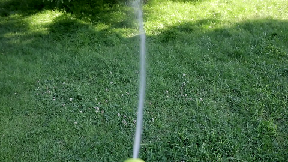
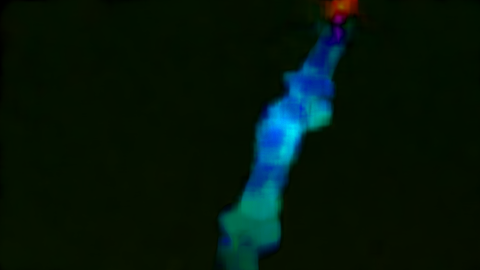
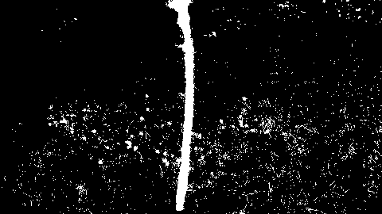
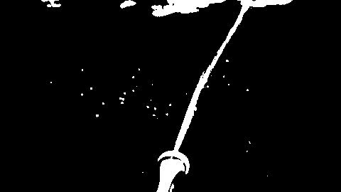
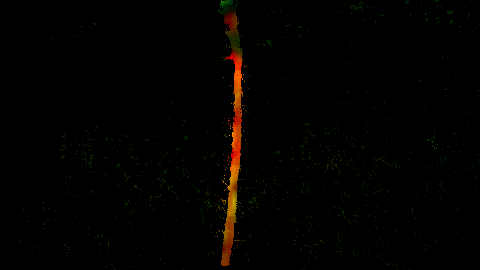

# Playground
Run, share, and play around with your code here.

## Playground #1: Water stream detection using optical flow
Source:

Optical flow:

Since water flow will look white/light gray, we can mask threshold the image to remove any other color.

An example of a threshold over saturation channel:

An example of a threshold over value channel:

Combining the two results gives:

Optical flow results can be masked with the combined channel results compared to unmasked results, as seen previously:

 

The tiny dots come from the flowers. Can remove it using a speckle filter or a guassian blur.

## Playground #2: Camera example scripts
The following scripts are modified or copied versions of the examples provided by [depthai-python](https://github.com/luxonis/depthai-python):

- [cam_test.py](/oakd_tests/cam_test.py)
- [collision_avoidance.py](/oakd_tests/collision_avoidance.py)
- [imu_gyroscope_accelerometer.py](/oakd_tests/imu_gyroscope_accelerometer.py)